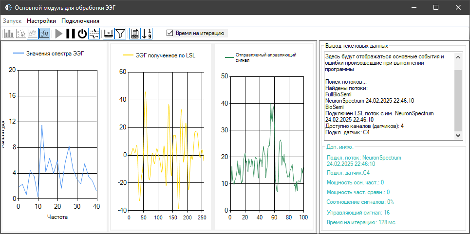
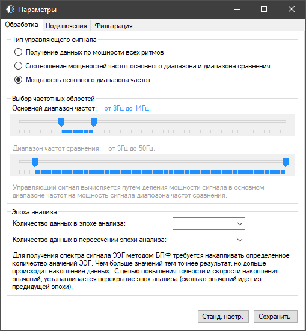
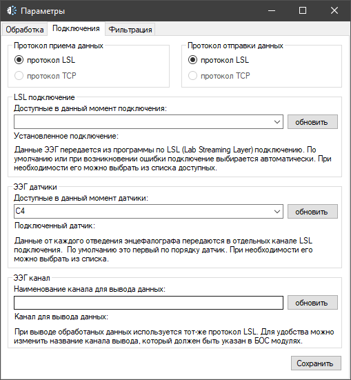

# EEG Processing Module 🧠

Программа на C# с Windows Forms для обработки сигналов ЭЭГ. Реализует фильтрацию сигналов и выделение мощности в определённом частотном диапазоне с использованием БПФ (быстрого преобразования Фурье). Ориентирована на использование в реабилитационных тренировках, где вычисленный показатель выраженности ритма управляет внешними программами и играми, создавая интерактивную систему взаимодействия на основе нейроинтерфейса.

Программа позволяет выбрать необходимый частотный диапазон и канал, гибко настроить параметры фильтрации и анализа. Работает с энцефалографами Нейрон-Спектр и их проприетарным ПО. Для взаимодействия с программным обеспечением энцефалографа используется Lab Streaming Layer (LSL) – протокол, широко применяемый в нейроинтерфейсах и ЭЭГ-исследованиях. Этот же протокол обеспечивает передачу управляющего сигнала в игры и тренинги, созданные на Unity, что позволяет строить адаптивные реабилитационные сценарии.

Примеры интерфейса:

